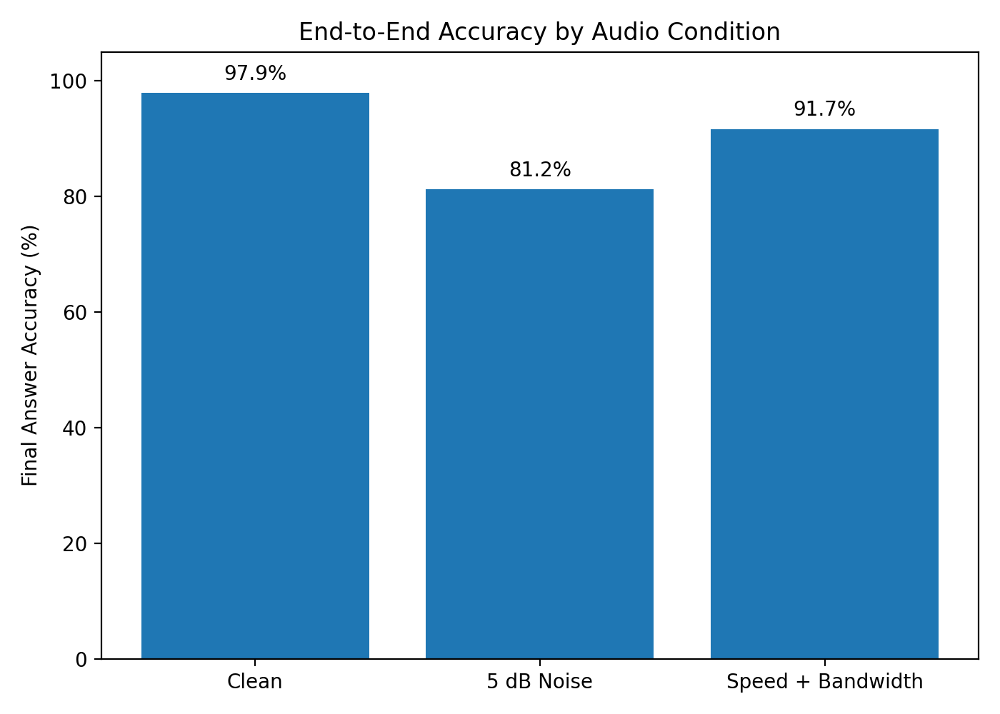
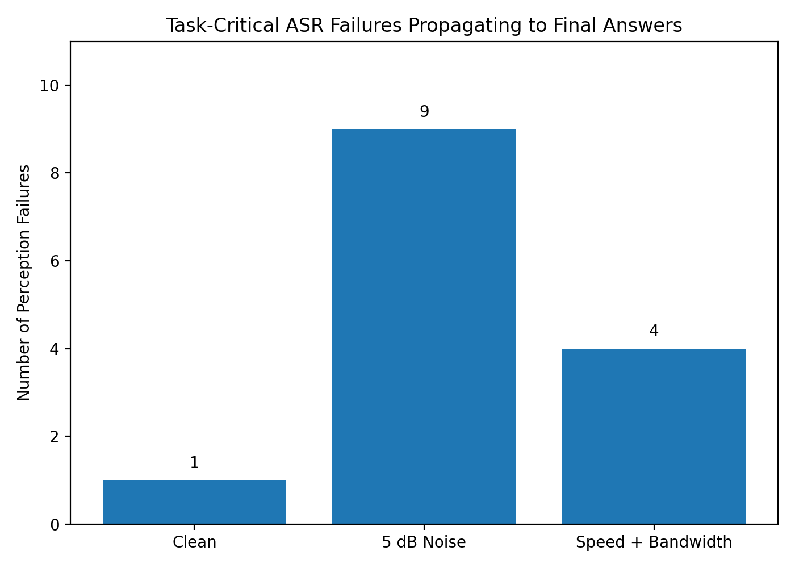
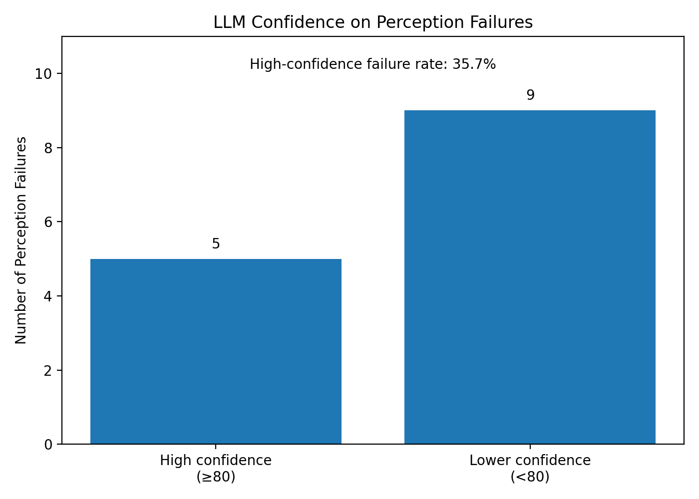

# Heard or Hard?

A small experiment on failure detection in a cascaded voice AI system.

The pipeline is simple:

**Audio → ASR → LLM → Answer**

When the final answer is wrong, it is not always clear whether the ASR misheard the user or the LLM reasoned incorrectly.

This project tries to separate these two types of failure.

## Research Questions

1. Are final answer errors caused by ASR or LLM reasoning?
2. Can ASR confidence detect important transcription errors?
3. Can LLM self-confidence detect errors already introduced by ASR?

## Setup

I created **48 short questions**:

- 24 entity-based questions
- 24 reasoning questions

Each question was tested under three audio conditions:

- Clean
- 5 dB Gaussian noise
- Speed + bandwidth degradation

This gives **144 audio samples** in total.

The system uses:

- Whisper Small for ASR
- Claude Haiku for answering
- Normalized WER
- ASR `avg_logprob`
- LLM self-confidence
- Final answer correctness
- LLM TTFT and total latency

## Task-Critical ASR Errors

Not every transcription error affects the final task.

For example:

```text
a box → the box
```

The transcript changes, but the meaning needed to answer the question stays the same.

However:

```text
B9D31 → B9031
```

changes the actual reference code.

I manually labelled an ASR error as **task-critical** when it changed or removed information needed to produce the original correct answer.

This includes important:

- numbers
- codes
- dates
- operations
- relationships
- task intent

## Failure Types

I classify each sample using the ASR result and the final LLM answer.

| Task-critical ASR error | Final answer | Type |
|---|---|---|
| No | Correct | Normal |
| No | Wrong | Reasoning failure |
| Yes | Correct | LLM rescue |
| Yes | Wrong | Perception failure |

## Results

### End-to-End Accuracy



| Condition | Accuracy |
|---|---:|
| Clean | 97.9% |
| 5 dB Noise | 81.2% |
| Speed + Bandwidth | 91.7% |

The 5 dB noise condition caused the largest drop in final answer accuracy.

### Failure Attribution



| Condition | Normal | Reasoning Failure | LLM Rescue | Perception Failure |
|---|---:|---:|---:|---:|
| Clean | 47 | 0 | 0 | 1 |
| 5 dB Noise | 39 | 0 | 0 | 9 |
| Speed + Bandwidth | 44 | 0 | 0 | 4 |

In this experiment, all **14 wrong final answers** were linked to task-critical ASR errors.

No standalone LLM reasoning failures were observed.

### High-Confidence Failures



There were 14 perception failures:

- 5 had LLM confidence ≥ 80
- 9 had LLM confidence < 80
- 35.7% were high-confidence failures

Some ASR errors produced transcripts that still looked completely valid to the LLM.

For example:

**Original**

```text
What is the reference code B9D31?
```

**ASR transcript**

```text
What is the reference code B9031?
```

**LLM answer**

```text
B9031
```

**LLM confidence**

```text
95
```

The LLM only sees the ASR transcript. Since `B9031` still looks like a valid reference code, it has little reason to know that the ASR made a mistake.

Other ASR errors produced obviously broken transcripts. In these cases, LLM confidence was often much lower.

For example:

```text
Original:
If 13 people are waiting and 3 leave, how many remain?

ASR:
If 13 people are waiting in three weeks, how many remain?

LLM:
Cannot be determined

Confidence:
15
```

This suggests that there may be a difference between **obvious ASR corruption** and **silent plausible corruption**.

## ASR Confidence

ASR `avg_logprob` did not clearly separate task-critical errors from normal samples in every condition.

For 5 dB noise:

| Group | Mean avg_logprob |
|---|---:|
| Task-critical ASR failure | -0.443 |
| Non-task-critical | -0.390 |

For speed + bandwidth degradation:

| Group | Mean avg_logprob |
|---|---:|
| Task-critical ASR failure | -0.284 |
| Non-task-critical | -0.309 |

The results suggest that a single ASR confidence threshold may not be enough to detect task-level failures.

## Main Findings

- WER alone does not show whether an ASR error actually affects the task.
- All final answer errors in this experiment were linked to task-critical ASR errors.
- Some corrupted transcripts caused the LLM to lower its confidence.
- Plausible ASR substitutions could still produce high-confidence wrong answers.
- 5 out of 14 perception failures had LLM confidence of at least 80.
- ASR confidence showed weak or inconsistent separation between task-critical and normal samples.

## Limitations

This is a small exploratory experiment.

- 48 synthetic English questions
- one synthetic speaker
- one ASR model
- one downstream LLM
- manually labelled task-critical ASR errors
- confidence threshold of 80 is a simple heuristic
- LLM confidence is self-reported and not calibrated
- latency includes API and network variation

The results should therefore be treated as observations from this experiment, not general conclusions about all voice AI systems.

## Project Structure

```text
heard-or-hard/
├── data/
│   ├── questions.jsonl
│   ├── asr_semantic_labels.jsonl
│   └── audio/
├── plots/
│   ├── accuracy_by_condition.png
│   ├── perception_failures_by_condition.png
│   └── perception_failure_confidence.png
├── runs/
├── src/
│   ├── generate_audio.py
│   ├── generate_degraded.py
│   ├── run_asr.py
│   ├── normalize.py
│   ├── merge_semantic_labels.py
│   ├── run_llm.py
│   ├── score_answers.py
│   ├── analyze_failures.py
│   ├── analyze_signals.py
│   ├── analyze_silent_failures.py
│   └── plot_results.py
└── tests/
```

## Running the Experiment

Install the required packages and set the Anthropic API key:

```bash
export ANTHROPIC_API_KEY="your-api-key"
```

Generate the audio:

```bash
python src/generate_audio.py
python src/generate_degraded.py
```

Run ASR:

```bash
python src/run_asr.py clean
python src/run_asr.py noisy
python src/run_asr.py hard
```

Merge the manual ASR annotations:

```bash
python src/merge_semantic_labels.py
```

Run the LLM:

```bash
python src/run_llm.py clean
python src/run_llm.py noisy
python src/run_llm.py hard
```

Score the answers:

```bash
python src/score_answers.py clean
python src/score_answers.py noisy
python src/score_answers.py hard
```

Run the analysis:

```bash
python src/analyze_failures.py
python src/analyze_signals.py
python src/analyze_silent_failures.py
python src/plot_results.py
```